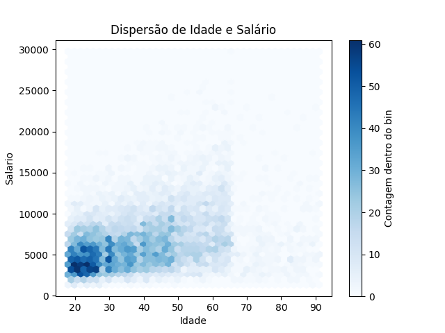
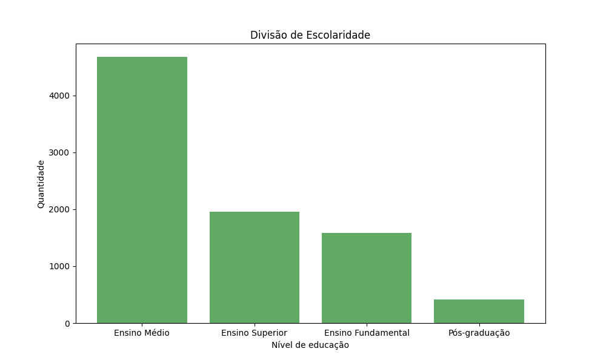
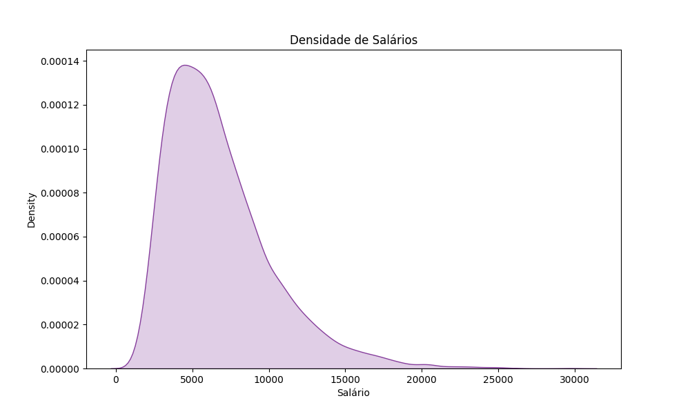
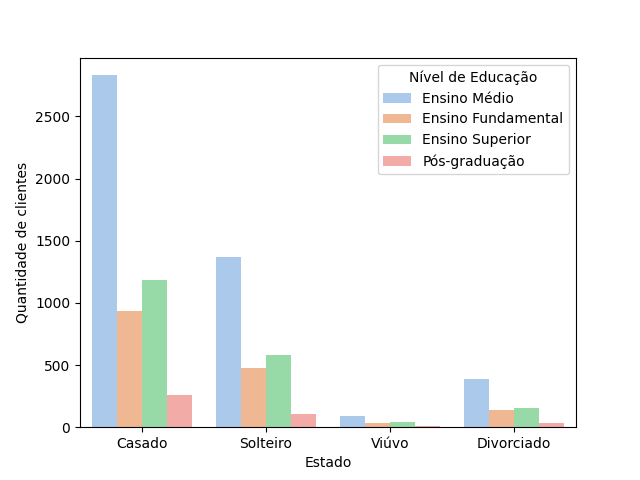
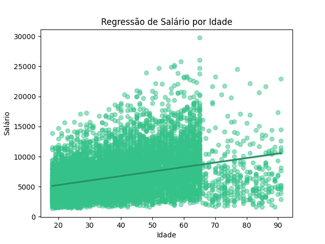
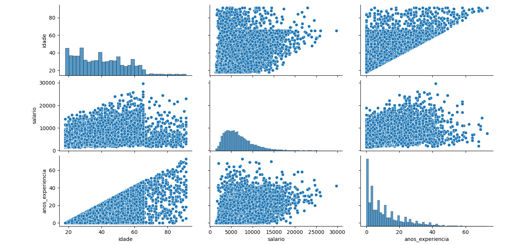

# Visualização de Dados com Python

Este projeto tem como objetivo explorar técnicas de visualização de dados utilizando as bibliotecas **Matplotlib** e **Seaborn** em Python. São apresentadas diversas formas de analisar e interpretar dados através de gráficos que facilitam a compreensão das relações entre variáveis.

## Estrutura do Projeto

- Código fonte em Python para geração das visualizações.
- Imagens dos gráficos gerados, organizadas em pastas separadas para Matplotlib e Seaborn.
- Análise visual de dados demográficos, como idade, salário, nível de escolaridade, estado civil e experiência.

---

## Imagens e Explicações

### Matplotlib

  
*Gráfico de dispersão mostrando a relação entre idade e salário dos indivíduos. Permite visualizar tendências e possíveis correlações entre as duas variáveis.*

  
*Histograma que exibe a distribuição do nível de escolaridade dos clientes, permitindo observar a frequência dos diferentes graus de instrução.*

  
*Gráfico de barras que demonstra a divisão percentual dos clientes por nível de escolaridade, facilitando a comparação entre categorias.*

---

### Seaborn

  
*Curva de densidade que ilustra a distribuição dos salários no conjunto de dados, mostrando onde se concentram os valores.*

  
*Gráfico de dispersão com ajuste visual mais refinado, mostrando a relação entre idade e salário.*

  
*Gráfico de barras agrupadas exibindo a quantidade de clientes distribuídos por estado civil e nível de educação.*

  
*Gráfico com linha de regressão que modela a relação entre salário e idade, indicando a tendência geral dos dados.*

  
*Gráfico tridimensional que explora a relação entre salário, idade e anos de experiência dos clientes.*

---

## Tecnologias Utilizadas

- Python 3.x  
- Matplotlib  
- Seaborn  
- Pandas (para manipulação dos dados)  
- Jupyter Notebook (para execução e visualização interativa)

---

## Como Executar

1. Clone o repositório:  
```bash
git clone https://github.com/Taynar4pS/Projetos-Python_Analise_de_Dados.git
```
2.Navegue até o diretório do projeto:
```bash
cd Projetos-Python_Analise_de_Dados/Visualizacao_dados
```
3.Execute os scripts Python ou abra os notebooks para visualizar os códigos e gerar as imagens.
